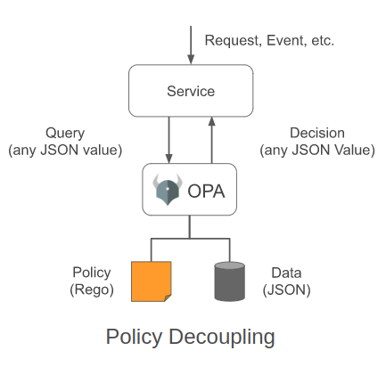
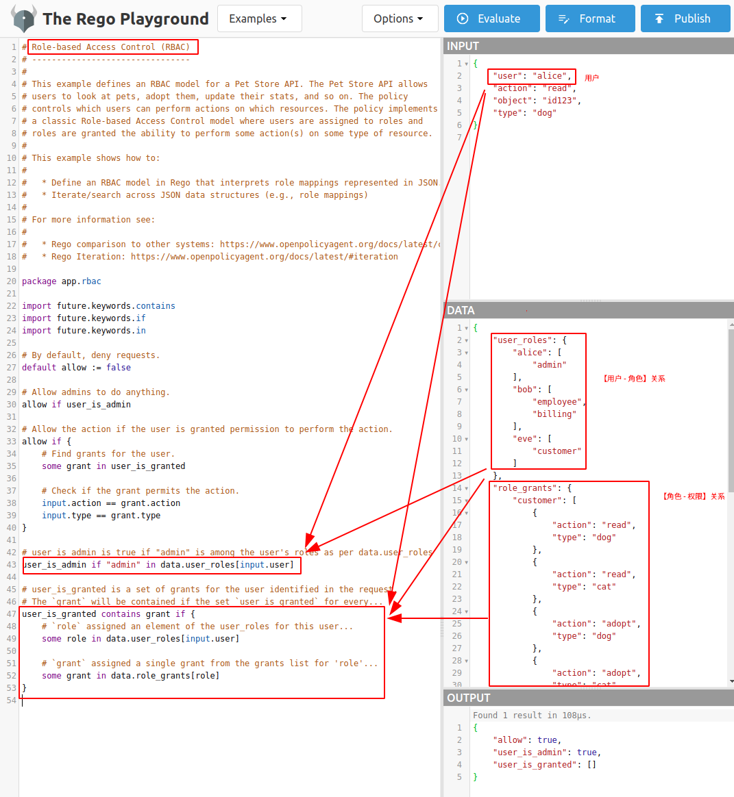
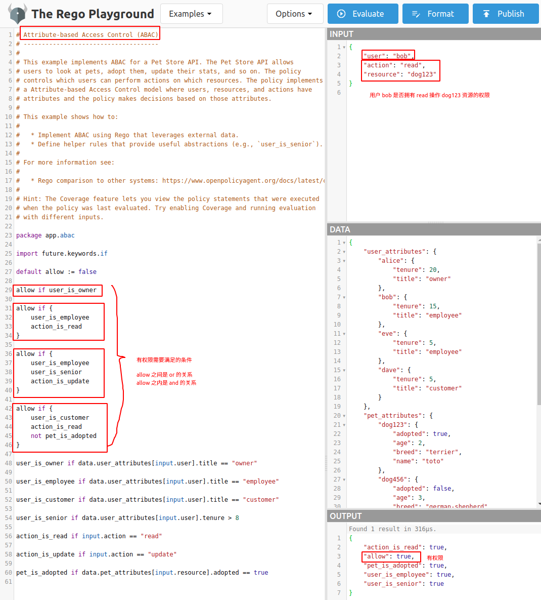
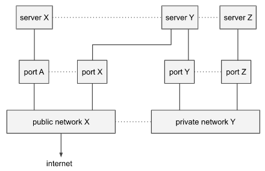

# OPA 基本介绍

## 基本介绍

`OPA (Open Policy Agent)` 是 `CNCF` 孵化的一个用于通用场景权限认证的完全开源项目，目前已经成功毕业。

`OPA` 的定位是一个**通用策略引擎**，需要作为一个独立的服务运行，既提供了高级声明性语言 `Rego` 来定义决策规则，又提供了简单的接口支持动态增删改查策略决策。因此使用 `OPA` 可以将程序中关于策略决策的逻辑从代码中剔除，不再需要硬编码策略决策，不再需要与具体的数据模型绑定。



在使用时，需要进行策略决策的程序需要先基于 `Rego` 定义决策规则并提交给 `OPA`，然后在需要进行策略决策的时候，通过 `API` 向 `OPA` 发起决策请求，由 `OPA` 基于规则进行策略决策，最后将决策结果返回给程序。

之所以称 `OPA` 为**通用**策略引擎，是因为其与领域无关，因此可以描述几乎任何类型的场景：

- 哪些用户可以访问哪些资源；
- 哪些子网允许出口流量；
- 工作负载必须部署到哪些集群；
- 二进制文件可以从哪些注册表下载；
- 容器可以拥有哪些系统权限执行；
- 系统哪些时间段内可以访问；
- ...


`OPA` 既支持实现 `ABAC` 的授权模式，也支持实现 `RBAC` 的授权模式：

- RBAC：

  - 规则中要定义“用户 - 角色”关系、“角色 - 权限”关系、怎么识别用户角色是否拥有指定权限，输入中要指定哪个用户要对哪类资源执行什么操作；
  - 主要功能：“管理员”有所有权限，“普通用户”只有对应角色对应的指定权限；

  
- ABAC：

  - 规则中要定义用户属性、资源属性、怎么识别用户角色是否拥有指定权限，输入中要指定哪个用户要对哪个资源执行什么操作；
  - 主要功能：“管理员”有所有权限，“普通用户”只有对应角色对应的指定权限；

  

## 示例场景



上述系统中有三种资源类型：

- `server` 对外暴露零个或多个 `protocol`，如 `http `、`ssh `、`telnet` 等；
- `network` 连接 `server`，并且区分 `public` 还是 `private`；
- `port` 将 `server` 依附到 `network`。

首先，所有 `server`、`network` 和 `port` 的关系以 `rego` 脚本的形式提交给 `OPA`，然后发起如下请求：

```json
{
    "servers": [
        {"id": "app", "protocols": ["https", "ssh"], "ports": ["p1", "p2", "p3"]},
        {"id": "db", "protocols": ["mysql"], "ports": ["p3"]},
        {"id": "cache", "protocols": ["memcache"], "ports": ["p3"]},
        {"id": "ci", "protocols": ["http"], "ports": ["p1", "p2"]},
        {"id": "busybox", "protocols": ["telnet"], "ports": ["p1"]}
    ],
    "networks": [
        {"id": "net1", "public": false},
        {"id": "net2", "public": false},
        {"id": "net3", "public": true},
        {"id": "net4", "public": true}
    ],
    "ports": [
        {"id": "p1", "network": "net1"},
        {"id": "p2", "network": "net3"},
        {"id": "p3", "network": "net2"}
    ]
}
```

如果我们需要添加如下限制：

```json
1. 所有可由外部访问的服务器都不能暴露 HTTP 协议（只能是 HTTPS）；
2. 所有服务器都不能暴露 telnet 协议；
```

我们可以基于 `OPA` 定义如下规则：

```
package net;
```


## REGO 入门

> `OPA` 提供了 [`Online Rego Playground`](https://play.openpolicyagent.org/) 帮助学习或测试 `Rego` 。

### 表达式

- 在规则中可以使用如下语法索引到输入数据中的指定属性：
  - `input.servers`：获取输入数据中的所有 `servers`；
  - `input.servers[0].protocols[0]`：获取输入数据中第一个 `server` 的第一个 `protocol`；
  - [内置函数](https://www.openpolicyagent.org/docs/v0.45.0/policy-reference/)：
    - `count(input.servers[0].protocols) >= 1`；
- 多个表达式可以用 `;` 分隔（表示 AND）写在同一行中，也可以不加 `;` 写在多行中；
- 如果查询中的任意表达式不为 `true` 或者 `undefined`，都会导致最终结果为 `undefined`；

### 变量

- 使用 `:=` 定义一个变量：
  - `servers := input.services`；
- 当使用变量引用一个不存在的属性时，会导致表达式的最终结果为 `undefined`；
- 变量不可变，当重复定义同一个变量时，会导致 `error`；
- 当使用一个没有定义的变量时，会导致 `error`；

### 迭代

- 找出所有满足条件的值：
  - `some i; input.servers[i].public == true`；
  - `some i, j; input.servers[i].protocols[j] == "http"`；
- `FOR SOME` - `some ... in ...`：

```
   public_network contains net.id if {
    some net in input.networks # some network exists and..
    net.public                 # it is public.
}

shell_accessible contains server.id if {
    some server in input.servers
    "telnet" in server.protocols
}

shell_accessible contains server.id if {
    some server in input.servers
    "ssh" in server.protocols
}
```

- `FOR ALL` - `every ... in ...`：

```
no_telnet_exposed if {
    every server in input.servers {
        every protocol in server.protocols {
            "telnet" != protocol
        }
    }
}

no_telnet_exposed_alt if { # alternative: every + not-in
    every server in input.servers {
        not "telnet" in server.protocols
    }
}

no_telnet_exposed_alt2 if { # alternative: not + rule + some
    not any_telnet_exposed
}

any_telnet_exposed if {
    some server in input.servers
    "telnet" in server.protocols
}
```

...

## 安装使用

### 安装

```shell
curl -L -o opa https://openpolicyagent.org/downloads/v0.45.0/opa_linux_amd64_static
chmod 755 ./opa

sudo mv ./opa /usr/local/bin/opa
```

### 使用

1. 定义 `example.rego`：

```
package example

default allow := false                              # unless otherwise defined, allow is false

allow := true {                                     # allow is true if...
    count(violation) == 0                           # there are zero violations.
}

violation[server.id] {                              # a server is in the violation set if...
    some server
    public_server[server]                           # it exists in the 'public_server' set and...
    server.protocols[_] == "http"                   # it contains the insecure "http" protocol.
}

violation[server.id] {                              # a server is in the violation set if...
    server := input.servers[_]                      # it exists in the input.servers collection and...
    server.protocols[_] == "telnet"                 # it contains the "telnet" protocol.
}

public_server[server] {                             # a server exists in the public_server set if...
    some i, j
    server := input.servers[_]                      # it exists in the input.servers collection and...
    server.ports[_] == input.ports[i].id            # it references a port in the input.ports collection and...
    input.ports[i].network == input.networks[j].id  # the port references a network in the input.networks collection and...
    input.networks[j].public                        # the network is public.
}
```

2. 定义 `input.json`：

```json
{
    "servers": [
        {"id": "app", "protocols": ["https", "ssh"], "ports": ["p1", "p2", "p3"]},
        {"id": "db", "protocols": ["mysql"], "ports": ["p3"]},
        {"id": "cache", "protocols": ["memcache"], "ports": ["p3"]},
        {"id": "ci", "protocols": ["http"], "ports": ["p1", "p2"]},
        {"id": "busybox", "protocols": ["telnet"], "ports": ["p1"]}
    ],
    "networks": [
        {"id": "net1", "public": false},
        {"id": "net2", "public": false},
        {"id": "net3", "public": true},
        {"id": "net4", "public": true}
    ],
    "ports": [
        {"id": "p1", "network": "net1"},
        {"id": "p2", "network": "net3"},
        {"id": "p3", "network": "net2"}
    ]
}
```

3. 非交互模式：

```shell
opa eval -i input.json -d example.rego "input.servers"

opa eval -i input.json -d example.rego "data.example.violation[x]"
```

4. 交互模式：

```shell
opa run example.rego repl.input:input.json

exit
```

5. 启动 server：

 在一个终端中执行：

```shell
opa run --server --addr :8282 example.rego
```

打开另一个终端：

```shell
cat <<EOF > v1-data-input.json
{
    "input": $(cat input.json)
}
EOF

curl localhost:8282/v1/data/example/violation -d @v1-data-input.json -H 'Content-Type: application/json'
curl localhost:8282/v1/data/example/allow -d @v1-data-input.json -H 'Content-Type: application/json'
```

6. 在 Go 中使用 `OPA`：

```Go
# https://www.openpolicyagent.org/docs/v0.45.0/#5-try-opa-as-a-go-library

package main

import (
	"context"
	"encoding/json"
	"fmt"
	"log"
	"os"

	"github.com/open-policy-agent/opa/rego"
)

func main() {

	ctx := context.Background()

	// Construct a Rego object that can be prepared or evaluated.
	r := rego.New(
		rego.Query(os.Args[2]),
		rego.Load([]string{os.Args[1]}, nil))

	// Create a prepared query that can be evaluated.
	query, err := r.PrepareForEval(ctx)
	if err != nil {
		log.Fatal(err)
	}

	// Load the input document from stdin.
	var input interface{}
	dec := json.NewDecoder(os.Stdin)
	dec.UseNumber()
	if err := dec.Decode(&input); err != nil {
		log.Fatal(err)
	}

	// Execute the prepared query.
	rs, err := query.Eval(ctx, rego.EvalInput(input))
	if err != nil {
		log.Fatal(err)
	}

    // Do something with the result.
	fmt.Println(rs)
}
```

执行：

```shell
go run main.go example.rego 'data.example.violation' < input.json
```

## 参考资源

1. [OPA v0.45.0 Docs - Introduction](https://www.openpolicyagent.org/docs/v0.45.0/)
2. [CNCF Landscape V2 - OPA](https://cncf.landscape2.io/?group=projects-and-products&item=provisioning--security-compliance--open-policy-agent-opa-)
