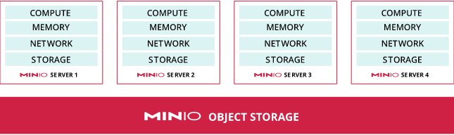

# MinIO 部署架构

`MinIO` 支持多种部署拓扑：

- 单节点单挂载（[Single Node Single Drive](https://min.io/docs/minio/kubernetes/upstream/operations/install-deploy-manage/deploy-minio-tenant.html#minio-snsd)）：如裸机部署并且使用本地磁盘上的一个目录；
- 单节点多挂载（[Single Node Multi Drive](https://min.io/docs/minio/kubernetes/upstream/operations/install-deploy-manage/deploy-minio-tenant.html#minio-snmd)）：如 `Docker` 部署一个 `Container` 并且有多个挂载卷；
- 多节点多挂载（[Multi Node Multi Drive](https://min.io/docs/minio/kubernetes/upstream/operations/install-deploy-manage/deploy-minio-tenant.html#minio-mnmd)）：如 `K8S` 部署多个 `Pod` 并且有多个持久卷。

## 生产环境

在生产环境中，通常都使用**多节点多挂载**部署架构，即使用多个计算和存储设备构建一个高可用的环境。

> 在 `MinIO` 中，`server pool` 表示一组 `MinIO` 服务节点，将所有计算、内存、网络和存储资源池化以更好地支撑读写请求。

对于生产环境而言，官方推荐至少部署 4 个服务节点，并且软硬件都需要保持一致（`homogeneous storage and compute resources`）。

需要注意的是，只有当直接使用本地存储时，如通过 `PCI-E` 接入 `NVMe` 或 `SSD`，`MinIO` 才会提供最好的读写性能！实际测试下来，通过 `NFS` 访问 `HDD` 上部署的 `MinIO` 时，当数据量大到一定程度时，峰值可能只有可怜的 `10MB/s`。

同时，`MinIO` 建议不要在驱动器或控制器层面进行缓存，因为任何形式的缓存技术都可能造成 I/O 峰值：因缓存填充或清除导致不可预测的性能。

## 参考

1. https://min.io/docs/minio/kubernetes/upstream/operations/concepts.html#
