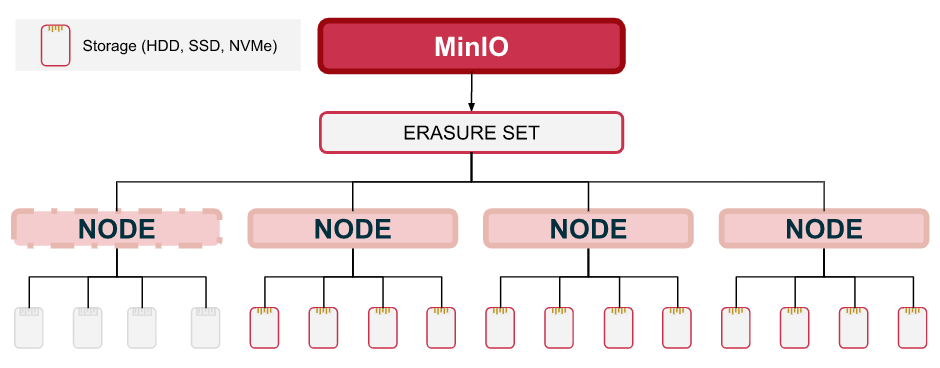

# MinIO 高可用性

`MinIO` 会自动将存储池中的驱动器分组到纠删码集（`erasure sets`）中。


## Erasure Coding

`MinIO` 基于 `Erasure Coding`（纠删码）技术实现数据冗余和高可用性。


官方提供的示例中，一个 `server pool` 中包含了 4 个服务节点，每个服务节点上都有 4 个存储驱动，也就是说一个 `Erasure Set` 中包含了 16 个存储驱动。

> 存储驱动（`Drive`）在 `K8S` 中对应到 `Volume - PVC`，可以在使用 [`Operator`](https://github.com/minio/operator) 部署时设置 `Storage Class`。

### Data/Parity Shard

对于每个写入操作，`MinIO` 都会将目标分为数据（`data`）和校验（`parity`）分片。

```
N (ERASURE SET SIZE) = K (DATA) + M (PARITY)
```


对于用于 `parity` 分片的存储驱动数量，我们可以将其设置为 `[0, N/2]` 之间的任一整数。对于上述示例，即为 `[EC:0, EC:8]`。


在上述示例中，`EC:4` 表示有 4 个存储驱动用于冗余数据来纠错校验，另外 12 个存储驱动用于原始数据。

> 注：使用特定 `parity` 配置写入的对象，如果后续改变了 `parity` 配置，则原有数据不会自动更新！

### Read/Write Quorum

`MinIO` 将一个对象分成若干分片存储在集群中，因此在读取时需要 `K` 个分片可用。`K` 值表示要正确读取一个对象，`Erasure Set` 中至少要有 `K` 个健康状态的存储驱动。


在上述示例中，写入对象时配置了 `EC:4` 和 `K=12`。当有一个服务节点离线时，即只有 12 个健康的存储驱动可用，是仍可以正常读取数据的。

当剩余可用的存储驱动小于 `K` 时，就无法正常读取到数据，但是可以通过诸如 [replication resynchronization](https://min.io/docs/minio/kubernetes/upstream/administration/bucket-replication/server-side-replication-resynchronize-remote.html#minio-bucket-replication-resynchronize) 机制恢复数据。


相应地，`MinIO` 也需要在写入时保证有 `K` 个健康状态的存储驱动可用。



注：要避免脑裂（`split-brain`）问题，需要保证当 `EC:M` 是 `N/2` 时，`Write Quorum` = `N/2 + 1`。


对于满足 `Read Quorum` 的对象，可以使用任何 `Data/Parity Shard` 来修复损坏或丢失的分片。


在上述示例中，`MinIO` 从 `Parity Shard` 中同步（`heal`）`Data Shard` 以保证可以正确读取数据。

### Read/Write Object

`MinIO` 在写入一个对象时，会将对象在每个 `Erasure Set` 中分片为 `K `个 `Data Shard `和 `M `个 `Parity Shard`。


`MinIO` 基于对象名称和路径的确定性哈希算法来选择给定对象的 `Erasure Set`。对于每个 `BUCKET/PREFIX/[PREFIX/...]/OBJECT.EXTENSION`，`MinIO` 总会选择相同的 `Erasure Set`。


每个 `MinIO` 服务节点都有一个完整的分布式拓扑图，这样应用程序就可以连接并直接操作任何节点。`MinIO` 通过负载均衡器实现上述功能，客户直接连接到负载均衡器上，由负载均衡器决定请求响应和具体的服务节点进行连接。


### Erasure Code Calculator

`MinIO` 提供了 [`Erasure Code Calculator`](https://min.io/product/erasure-code-calculator) 计算原始存储和可用存储的关系。


上述示例提供了这样一个示例：

- 1 个机柜上部署了 4 个服务节点，每个服务节点上挂载 12 个存储驱动，每个存储驱动 4 TiB，因此原始容量为 `4 x 12 x 4 = 192 TiB`；
- 每个对象写入分成 12 个 `Data Block` 和 4 个 `Parity Block`，其中 `4 / (4 + 12) x 100% = 75%`   的 `Parity Block` 作为冗余数据存在，因此可用容量为 `192 x 75% = 144 TiB`；
- 当 **1 个节点**或者 **4 个驱动**故障时，系统仍可继续正常工作，可以简单理解为允许 `25%` 的故障率；

## 运维操作

### 某个服务节点磁盘数据完全丢失，如何恢复数据

可以借助 `mc admin heal` 命令进行恢复：

```shell
# 进行同步
mc admin heal <host>/<bucket>/<path> --recursive
```

示例如下：


在某些情况下，上述步骤可能无法正确执行，可以直接删除故障节点上各个 `Volume` 下的数据目录，再重新执行同步即可。
