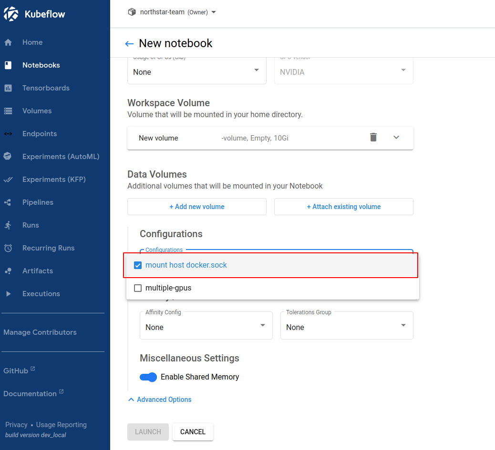

# 在 Kubeflow Notebook 中使用 Docker

## 构建镜像

```shell
# 构建
docker build -f Dockerfile -t demo:dind .

# 测试
# 需要确保宿主机已经成功安装并启动了 Docker Engine: https://docs.docker.com/engine/install/
docker run --rm -it --name dind -v /var/run/docker.sock:/var/run/docker.sock demo:dind docker ps

docker run --rm -it --name dind -v /var/run/docker.sock:/var/run/docker.sock demo:dind docker compose ps
```

## 使用镜像

在 `K8S` 集群中应用 `PodDefault`：

```shell
kubectl apply -f kubeflow.yaml
```

在创建 `Kubeflow Notebook` 时选择配置：



在启动 `Kubeflow Notebook` 后使用 `Docker`：

```shell
sudo docker ps

sudo docker-compose ps
```

## 权限配置

- 是否可以根据 `Kubeflow Notebook` 的用户身份决定用户是否有权使用 `Docker`？
- 是否可以实现更细粒度的权限控制？
