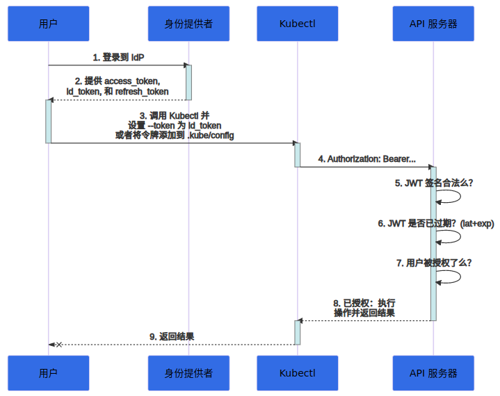

# K8S 身份认证

## 身份认证策略

`K8S` 支持多种身份认证策略。

### OpenID Connect (OIDC)

> https://kubernetes.io/zh-cn/docs/reference/access-authn-authz/authentication/#openid-connect-tokens



#### 配置 API 服务器

API 服务器在这里指 `kube-apiserver`，可以通过 `/etc/kubernetes/manifests/kube-apiserver.yaml` 文件进行配置：

```yaml
...

spec:
  containers:
  - command:
    - kube-apiserver
    - ...
    - oidc-issuer-url=...
    - oidc-client-id=...
    - ...
...
```

修改上述文件后，`kube-apiserver` 会自动进行重启。
